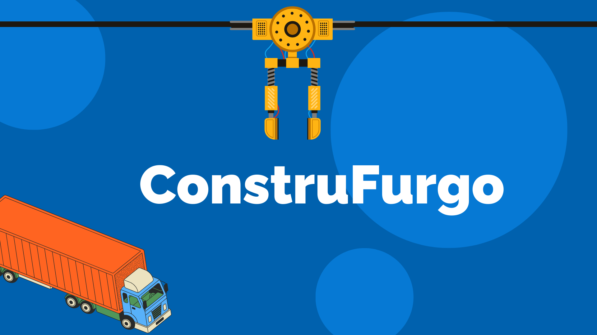

# 🚚 **ConstruFurgo** 🚚

# 🚀 Introducción

**ConstruFurgo** es una empresa líder en la fabricación y comercialización de furgones industriales. Su rápido crecimiento generó la necesidad de optimizar la gestión de clientes y procesos internos. Para abordar este desafío, se implementó **Salesforce**, logrando:

✅ Una plataforma robusta y concisa.

✅ Mayor eficiencia operativa.

✅ Automatización de procesos.

## ❓ **Desafíos de ConstruFurgo**

⚠️ Falta de un sistema centralizado para clientes y oportunidades de negocio.

⚠️ Dificultades en la automatización de flujos de trabajo y reportes.

⚠️ Deficiencias en seguridad y auditoría de datos.

## 📄 **Documentación**

Para más detalles sobre el sistema y su funcionamiento, consulta la documentación en <a href="https://www.notion.so/ConstruFurgo-1b5b22de53f680dfa859d38241e51daa" target="_blank">**Notion**.</a>

## 🎥 **Presentación del Proyecto**

Descubre cómo **ConstruFurgo** está revolucionando la industria con Salesforce. Mira la presentación aquí:

<a href="https://www.canva.com/design/DAGh7zLyCpo/P6AZWYhzAlnk2gtgMuKs4w/edit?utm_content=DAGh7zLyCpo&utm_campaign=designshare&utm_medium=link2&utm_source=sharebutton" target="_blank">👉 **Presentación de ConstruFurgo**</a>

## 🛠️ **Herramientas Utilizadas**

🔹 Excel

🔹 Visual Studio Code

🔹 Salesforce

🔹 Notion

🔹 Canva

🔹 Github

## 👤 **Desarrollado por:**

🔹 **Juan Felipe Rubio Sanabria**

🚀 ¡Gracias por ser parte de **ConstruFurgo**!